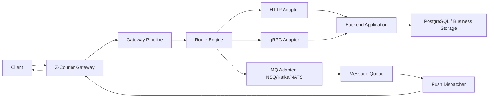

# Z-Courier Architecture

Z-Courier is an open-source reliable message push gateway built on top of
Zinx. Its core job is connection access, metadata-based routing, and delivery
coordination. It does not understand business payloads.

The gateway treats every packet as an envelope:

```text
metadata + opaque body
```

Business systems own the body schema, persistence rules, and domain logic. The
gateway owns connection binding, authentication, traffic control, route
selection, forwarding, downlink delivery, and observability.

## Goals

- Provide a TCP long-connection gateway based on Zinx.
- Route upstream messages by protocol metadata, especially `MsgID`.
- Support pluggable upstream targets such as HTTP, gRPC, NSQ, Kafka, NATS, and
  custom adapters.
- Support reliable downlink delivery with ACK, retry, idempotency, and
  reconnect recovery.
- Keep authentication, blacklist, whitelist, rate limit, logging, tracing, and
  metrics in a unified processing chain.
- Avoid binding the open-source middleware to one deployment style, one backend
  framework, or one message queue.

## Non-Goals

- Z-Courier does not parse or validate business payload fields.
- Z-Courier does not replace the business system's source-of-truth database.
- Z-Courier does not guarantee exactly-once delivery. It should provide
  at-least-once delivery with idempotency hooks.
- Z-Courier does not require microservices. A monolith can be used through HTTP
  or gRPC adapters.

## High-Level Flow



## Core Components

### 1. Protocol Layer

The protocol layer decodes and encodes packets between clients and the gateway.
The gateway should require a small, stable header and leave the body opaque.

Recommended header fields:

```text
Version       protocol version
MsgID         route and command identifier
ClientID      claimed client identity
DeviceID      device identity
SessionID     gateway-issued session identity
MessageID     globally unique message identity
Seq           per-connection sequence number
TraceID       trace correlation id
Timestamp     client send timestamp
Flags         bit flags, such as ack-required or compressed
BodyLength    payload length
Body          opaque business payload
```

Important rule: `ClientID` from the packet is not trusted until the token is
verified. After authentication, the gateway should bind the connection to the
identity derived from the token.

### 2. Connection Manager

The connection manager maintains online routing and session state.

Recommended indexes:

```text
conn_id -> session
client_id -> device_id -> conn_id
session_id -> conn_id
client_id -> gateway_node
```

This allows the gateway to support:

- Multi-device online sessions.
- Single-device push.
- User-level push.
- Kick-out by device or user.
- Gateway node lookup for downlink delivery.
- Reconnect recovery.

In single-node mode, this state can live in memory. In cluster mode, online
routing should be mirrored to Redis or another distributed store.

### 3. Gateway Pipeline

All upstream packets should pass through a unified chain before routing.

Suggested order:

```text
Decode
-> Protocol validation
-> Authentication
-> Blacklist / whitelist
-> Rate limiting
-> Session binding
-> Replay and idempotency check
-> Logging / tracing / metrics
-> Route selection
-> Forwarding
```

The same pipeline idea should also exist for downlink delivery:

```text
Receive push request
-> Validate internal auth
-> Locate target connection
-> Check delivery policy
-> Enqueue to connection send queue
-> Flush to client
-> Wait for client ACK when required
```

### 4. Route Engine

The route engine maps packet metadata to a target adapter. `MsgID` is the
primary routing key, but routes should also be able to match tenant, client
type, protocol version, or flags later.

Example:

```yaml
routes:
  - name: chat-upstream
    match:
      msg_id_range: [1001, 1999]
    target:
      type: http
      url: http://backend:8080/gateway/upstream
      ack_mode: processed

  - name: async-events
    match:
      msg_id_range: [2000, 2999]
    target:
      type: nsq
      nsqd_addrs:
        - nsqd-a:4150
        - nsqd-b:4150
      topic: message_events
      write_timeout: 1s
      publish_mode: round_robin
      retry_attempts: 1
      ack_mode: queued

  - name: grpc-business
    match:
      msg_id_range: [3000, 3999]
    target:
      type: grpc
      endpoint: backend:9000
      method: GatewayService/Upstream
      ack_mode: processed
```

The gateway core should depend on an adapter interface, not concrete transports.

```go
type Forwarder interface {
    Forward(ctx context.Context, packet *Packet) (*ForwardResult, error)
}
```

Built-in adapters can include HTTP and NSQ first. gRPC, Kafka, NATS, Redis
Stream, and custom plugin adapters can be added behind the same interface.

### 5. ACK Semantics

An open-source gateway must make ACK meaning explicit. A response to the client
should not be ambiguous.

Recommended ACK modes:

```text
received     gateway decoded and accepted the packet
queued       packet was written to a queue or durable buffer
persisted    packet was persisted by gateway or backend
processed    backend processed the packet successfully
delivered    downlink packet was written to the client connection
client_acked client explicitly acknowledged receipt
```

Different routes may use different modes. Reliable business messages should
prefer `persisted`, `processed`, or `client_acked`, depending on latency and
consistency needs.

## Upstream Design

Upstream means client-to-backend traffic.

Recommended first stable path:

```text
Client
-> Zinx Gateway
-> Pipeline
-> Route Engine
-> HTTP/gRPC Backend Adapter
-> Backend persists to PostgreSQL
-> Backend writes outbox or publishes to MQ
```

For high-throughput async events:

```text
Client
-> Zinx Gateway
-> Pipeline
-> Route Engine
-> MQ Adapter
-> Backend Consumer
-> PostgreSQL
```

The route configuration decides which path is used. The client only knows it is
sending a `MsgID` packet to the gateway.

## Downlink Design

Downlink means backend-to-client traffic.

Recommended APIs:

```text
POST /internal/push
POST /internal/push/batch
GET /internal/message/status
GET /internal/messages
POST /internal/message/requeue
POST /internal/messages/requeue
POST /internal/message/discard
POST /internal/debug/push
GET /internal/debug/route
GET /internal/debug/sessions
GET /internal/debug/cluster/routes
POST /internal/kick
```

`GET /internal/debug/route?client_id=...&device_id=...` returns the local
session, if present, and the cluster online route, if cluster routing is enabled.
`GET /internal/debug/sessions?session_id=...&client_id=...&device_id=...&limit=...`
lists local sessions on the current gateway node. The filters are local-only:
`session_id` is an exact lookup, while `client_id` and `device_id` narrow the
local session list.
`GET /internal/debug/cluster/routes?session_id=...&client_id=...&device_id=...&limit=...`
lists online routes from the configured cluster registry. This is the
cluster-wide view used by the admin console: it shows the owning gateway node,
internal address, route TTL, and whether the queried gateway also has the local
TCP session.
`POST /internal/debug/push` is the browser-console test-push endpoint. It
reuses the normal downlink delivery path and is protected by the
`downlink:test_push` admin permission. Responses include remote-operation
metadata such as `delivery_path`, `origin_gateway_node`, `target_gateway_node`,
`failure_stage`, and `failure_code` so operators can distinguish local writes
from cluster peer pushes and peer-dispatch failures.

Downlink request envelope:

```text
TargetType     client, device, session, broadcast, topic
ClientID
DeviceID
SessionID
MessageID
MsgID
AckRequired
ExpireAt
Body
```

Cluster routing:

```text
Backend or dispatcher
-> lookup client_id/device_id in online route store
-> call the target gateway node
-> gateway pushes to local connection
-> client ACK returns through gateway
-> backend updates delivery state
```

For open-source users, this should support two modes:

- Single-node mode: local in-memory connection routing.
- Cluster mode: shared online route store and node-to-node downlink dispatch.

## Reliability Model

Z-Courier should aim for at-least-once delivery.

Required building blocks:

- `MessageID` for idempotency.
- `Seq` for per-connection order and replay detection.
- Client ACK for reliable downlink.
- Retry policy with max attempts and backoff.
- Expiration policy for stale messages.
- Dead-letter handling for permanently failed messages.
- Reconnect recovery using `last_ack_message_id` or `last_ack_seq`.
- Durable state in backend storage such as PostgreSQL.
- Optional outbox pattern for backend-to-MQ consistency.

Recommended message states:

```text
created
persisted
queued
sent_to_gateway
sent_to_client
client_acked
failed
expired
discarded
dead_lettered
```

## Security Model

Authentication must be consistent between the gateway and backend.

Supported strategies:

- Local JWT verification with shared public keys or JWKS.
- Remote token verification through backend `/auth/verify`.
- Shared auth SDK for gateway and backend.
- Token blacklist or token version lookup for revoke and kick-out.

Internal APIs such as `/internal/push` should require stronger trust controls:

- mTLS or signed internal requests.
- Shared internal secret for simple deployments.
- Timestamp and nonce to prevent replay.
- IP allowlist where appropriate.

Backend-facing internal APIs and cluster peer push support optional canonical
HMAC-SHA256 modes with separate key rings and bounded local nonce replay
protection. The wire contract and deployment limits are documented in
[internal-http-signing.md](internal-http-signing.md).

## Rate Limiting and Backpressure

Rate limits should exist at multiple levels:

```text
IP
ClientID
DeviceID
MsgID
Route target
Gateway node
Global backend protection
```

When downstream targets are slow, the gateway should apply backpressure instead
of growing memory without bounds. Possible actions:

- Reject new packets with a retryable error.
- Drop non-critical packets by policy.
- Slow down reads from client connections.
- Bound per-connection send queues.
- Trip circuit breakers for failing route targets.

## Observability

The gateway should emit structured logs, metrics, and traces.

Core metrics:

```text
z_courier_ingress_packets_total
z_courier_ingress_rejected_total
z_courier_upstream_forward_total
z_courier_upstream_forward_duration_seconds
z_courier_upstream_inflight
z_courier_upstream_overload_rejected_total
z_courier_sessions_online
z_courier_clients_online
z_courier_internal_http_inflight
z_courier_internal_http_overload_rejected_total
z_courier_downlink_push_total
z_courier_downlink_ack_total
z_courier_downlink_ack_latency_seconds
z_courier_downlink_requeue_total
z_courier_downlink_bulk_requeue_total
z_courier_downlink_discard_total
z_courier_downlink_cleanup_total
z_courier_downlink_cleanup_deleted_total
z_courier_downlink_cleanup_duration_seconds
z_courier_rate_limit_rejected_total
z_courier_auth_verify_total
z_courier_auth_verify_duration_seconds
z_courier_auth_inflight
z_courier_auth_cache_total
z_courier_auth_jwks_refresh_total
z_courier_auth_jwks_refresh_duration_seconds
```

The first Prometheus scrape endpoint is exposed on the internal HTTP server at
`/metrics`.

The internal HTTP server also exposes `/healthz` and `/readyz`. `/readyz`
switches to `503` as soon as graceful shutdown begins, before the gateway stops
background workers and removes this node's online routes.

Every packet should carry or receive a `TraceID`. Forwarded HTTP/gRPC/MQ
requests should preserve that trace id.

## Suggested Repository Layout

```text
cmd/gateway/                 gateway entry point
configs/                     sample configs
internal/server/             Zinx server bootstrap
internal/protocol/           packet codec and protocol types
internal/session/            connection binding and online state
internal/pipeline/           middleware chain
internal/router/             route matching and dispatch
internal/adapter/httpforwarder/ HTTP forwarder
internal/adapter/nsqforwarder/  NSQ forwarder
internal/downlink/           internal push APIs and delivery queue
internal/auth/               token verification interfaces
internal/ratelimit/          rate limiting implementations
internal/observability/      logs, metrics, tracing
pkg/sdk/                     public protocol and integration SDK packages
pkg/errors/                  public error codes
docs/                        design and operation documents
```

## MVP Scope

The first implementation should stay small but complete:

- Zinx TCP server.
- Binary protocol codec with `ClientID`, `DeviceID`, `MsgID`, `MessageID`,
  `Seq`, `Token`, and `Body`.
- Authentication interface with one JWT implementation and one remote HTTP
  verification implementation.
- Connection binding and in-memory session manager.
- Pipeline with auth, blacklist/whitelist hooks, rate limit hook, and logging.
- `MsgID` route engine.
- HTTP forwarder adapter.
- NSQ forwarder adapter.
- Internal HTTP downlink push API.
- Client ACK handling.
- Retry metadata and idempotency hooks.
- Prometheus metrics.
- Example backend and example client.

## Roadmap

Delivered through the V2 phase:

- Redis cluster online route store.
- Gateway-to-gateway downlink dispatch.
- PostgreSQL-backed reliable delivery and retry state.
- Cluster, retry, capacity, and cleanup observability.

V3 priorities are tracked in
[v3-auth-integration.md](v3-auth-integration.md):

- Configuration-selectable static, HTTP, and JWT/JWKS token verification.
- A consistent principal and verifier error contract.
- Bounded auth caching, timeout, backpressure, and metrics.
- Minimal Go protocol and backend integration SDKs. Both are implemented under
  `pkg/sdk`; the high-level reconnecting client SDK remains a later extension.
- Optional replay-resistant internal request signing.

Later extensions:

- gRPC forwarder adapter.
- Kafka and NATS adapters.
- Admin API and dashboard.
- Hot-reloadable route configuration.
- Multi-tenant isolation.
- OpenTelemetry tracing.
