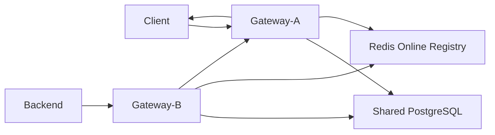
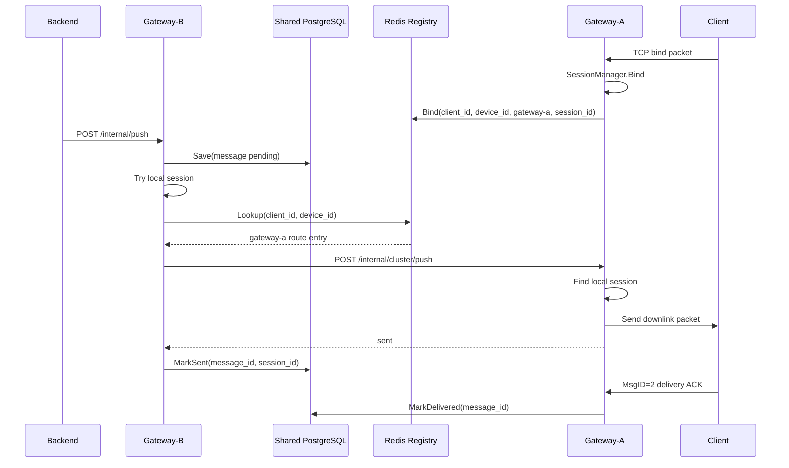
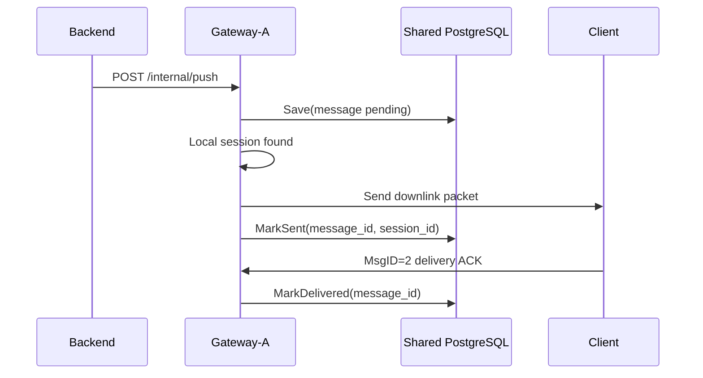
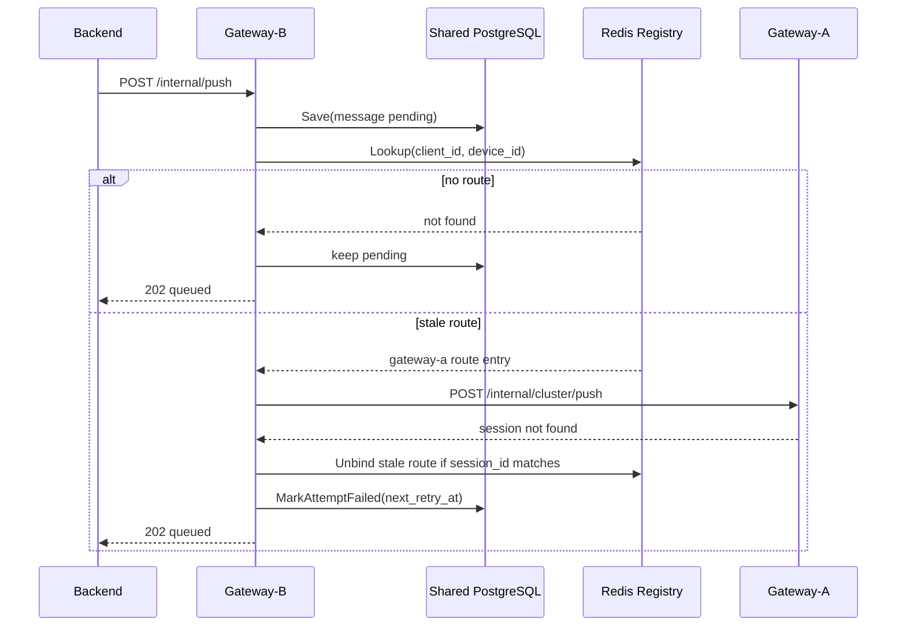

# V2 Cluster Architecture

V2 turns the V1 single-node reliable push gateway into a cluster-capable
gateway. The main problem is cross-node downlink delivery:

```text
Client is connected to Gateway-A.
Backend sends /internal/push to Gateway-B.
Gateway-B must find Gateway-A and dispatch the downlink packet there.
Gateway-A pushes to the local TCP connection.
Client ACK is accepted by Gateway-A and persisted in shared storage.
```

V2 keeps the V1 rule that Z-Courier does not understand business payloads. The
gateway still routes and delivers metadata envelopes with opaque body bytes.

## Goals

- Keep V1 single-node behavior working by default.
- Add a shared online route registry for `client_id + device_id`.
- Add gateway-to-gateway downlink dispatch.
- Keep reliable downlink storage compatible with PostgreSQL.
- Make stale online routes safe: a stale route should not lose the message.
- Provide local multi-node E2E coverage.

## Non-Goals

- V2 does not implement exactly-once delivery.
- V2 does not require a service mesh or microservice backend.
- V2 does not replace PostgreSQL as the reliable downlink store.
- V2 does not add full admin APIs or route hot reload yet.
- V2 does not implement SDKs yet.

## Target Topology



Key point:

```text
Session Manager = local in-memory connection table.
Online Registry = shared cluster route table.
Downlink Store = reliable message state storage.
```

## Components

### Local Session Manager

Existing V1 component:

```text
internal/session.Manager
```

It remains local to one gateway process. It knows:

```text
conn_id -> session
session_id -> conn_id
client_id + device_id -> conn_id
```

V2 should not replace it with Redis. TCP connections are process-local, so the
connection table must remain local.

### Online Registry

New V2 abstraction. It stores the cluster-visible route for a client device:

```go
type OnlineRegistry interface {
    Bind(ctx context.Context, entry RouteEntry) error
    Unbind(ctx context.Context, key RouteKey, sessionID string) error
    Lookup(ctx context.Context, key RouteKey) (RouteEntry, bool, error)
    Touch(ctx context.Context, entry RouteEntry) error
    Close() error
}
```

Suggested data types:

```go
type RouteKey struct {
    ClientID string
    DeviceID string
}

type RouteEntry struct {
    ClientID     string
    DeviceID     string
    SessionID    string
    GatewayNode  string
    InternalAddr string
    TokenID      string
    UpdatedAt    time.Time
    ExpiresAt    time.Time
}
```

The registry is an online hint, not the reliable source of message truth. If it
is missing or stale, the message stays pending in the downlink store and retry
will try again later.

### Redis Registry

First shared implementation:

```text
key: zcourier:online:{client_id}:{device_id}
ttl: cluster.registry.ttl
value:
  client_id
  device_id
  session_id
  gateway_node
  internal_addr
  token_id
  updated_at
```

Node metadata can be stored separately:

```text
key: zcourier:node:{gateway_node}
ttl: cluster.node.ttl
value:
  gateway_node
  internal_addr
  started_at
  updated_at
```

For V2, the device route entry may include `internal_addr` directly. A separate
node table is still useful for future health checks and admin views.

### Peer Dispatcher

New gateway-to-gateway client:

```go
type PeerDispatcher interface {
    Push(ctx context.Context, target RouteEntry, req PeerPushRequest) (*PeerPushResponse, error)
}
```

It calls the target gateway internal API:

```text
POST /internal/cluster/push
```

This API is for gateway peers only. Token mode protects it with
`cluster.peer.token` in the `X-ZCourier-Internal-Token` header. V3.5 also
supports timestamped HMAC-SHA256 signatures with a separate peer key ring and
nonce replay protection.

### Downlink Resolver

V2 `downlink.Service` performs cluster-aware delivery:

```text
1. Save message to shared store.
2. Try local session manager.
3. If not local, lookup online registry.
4. If target node is current node, retry local delivery.
5. If target node is remote, call PeerDispatcher.
6. If delivery fails, keep pending and schedule retry.
```

## Configuration

Suggested V2 config shape:

```yaml
gateway_node: gateway-a

cluster:
  enabled: true
  internal_addr: http://gateway-a:18082
  route_refresh_interval: 10s
  registry:
    type: redis
    ttl: 30s
    redis:
      addr: redis:6379
      username: ""
      password: ""
      db: 0
      key_prefix: zcourier
      dial_timeout: 1s
      read_timeout: 1s
      write_timeout: 1s
  peer:
    token: dev-cluster-token
    timeout: 2s
    auth:
      mode: token
```

Compatibility rule:

```text
cluster.enabled = false
```

means V1 behavior: local session manager only, no Redis lookup, no peer
dispatch.

The existing `gateway_node` should remain the logical node identifier. V2 can
add `cluster.internal_addr` because other nodes need a callable address.

If `route_refresh_interval` is omitted, the server defaults it to
`cluster.registry.ttl / 3`. As long as the local TCP session is alive, the
gateway refreshes the shared online route even when the client sends no
upstream packets.

## Cross-Node Downlink Flow



Important property:

```text
The backend can call any gateway node.
The node that receives /internal/push owns the first Save.
The target node only pushes to its local TCP connection.
ACK can be handled by any node as long as storage is shared.
```

## Local Downlink Flow



This is the V1 flow with shared storage and the same local session manager.

## Offline Or Stale Route Flow



The stale-route case must be safe. A gateway should only remove a route when
the `session_id` still matches the stale entry it attempted to use.

## Peer Push API

Endpoint:

```text
POST /internal/cluster/push
```

Request body:

```json
{
  "origin_node": "gateway-b",
  "client_id": "client-1",
  "device_id": "device-1",
  "session_id": "zs_xxx",
  "msg_id": 2001,
  "message_id": "message-1",
  "trace_id": "trace-1",
  "ack_required": true,
  "body": "aGVsbG8="
}
```

Response body:

```json
{
  "code": "ok",
  "delivery_state": "sent",
  "gateway_node": "gateway-a",
  "session_id": "zs_xxx",
  "message_id": "message-1"
}
```

Current status behavior:

```text
200 sent              local TCP send succeeded
404 session_not_found route is stale or client disconnected
401 unauthorized      peer token or HMAC signature invalid
429 rate_limited      peer protection rejected request
5xx retryable failure target gateway had an internal error
```

The peer endpoint should not create a new durable message row. Durable state is
owned by the node that received `/internal/push` and saved the message.

## ACK Handling

Client ACK still uses:

```text
MsgID = 2
```

The ACK packet is still sent from client to gateway. In cluster mode, the ACK
usually reaches the node that owns the TCP connection.

Because V2 reliable cluster mode uses shared downlink storage, that node can
call:

```text
Store.MarkDelivered(message_id, client_id, device_id, delivered_at)
```

without calling the origin node.

## Internal Debug APIs

The internal HTTP server exposes two debugging endpoints protected by the same
internal token as the downlink API:

```text
GET /internal/debug/route?client_id=...&device_id=...
GET /internal/debug/sessions?client_id=...&limit=...
```

They answer different questions:

```text
/internal/debug/route
  "Where would this node route this client/device?"
  Checks the current node's local session table first, then the shared cluster
  online registry when cluster mode is enabled.

/internal/debug/sessions
  "Which sessions are local to this gateway process?"
  Reads only the current node's in-memory session manager. It does not list
  cluster-wide online routes.
```

Example: if the client is connected to `gateway-b` and the query is sent to
`gateway-a`, `/internal/debug/route` should return `local_session_found=false`
and `cluster_route.gateway_node=gateway-b`. `/internal/debug/sessions` on
`gateway-a` should return no local session for that client, while the same
query against `gateway-b` should return the local session.

## Retry Worker

Every gateway node can run a retry worker. To avoid two nodes delivering the
same due message at the same time, the PostgreSQL store claims due rows before
retry delivery.

Store extension:

```go
type ClaimStore interface {
    ClaimDueRetry(ctx context.Context, now time.Time, ackTimeout time.Duration, limit int, owner string, lease time.Duration) ([]Message, error)
}
```

The Postgres implementation uses `FOR UPDATE SKIP LOCKED` and stores
`claim_owner` plus `claim_until`. `MarkSent`, `MarkAttemptFailed`,
`MarkDelivered`, and `MarkFailed` clear the claim. If a gateway crashes after
claiming a message, another node can retry it after `downlink.delivery.retry_lease`.

## Metrics

V2 cluster metrics:

```text
z_courier_cluster_registry_lookup_total{result}
z_courier_cluster_registry_bind_total{result}
z_courier_cluster_registry_unbind_total{result}
z_courier_cluster_registry_touch_total{result}
z_courier_cluster_peer_push_total{target_node,result}
z_courier_cluster_peer_push_duration_seconds{target_node,result}
z_courier_cluster_stale_routes_total{reason}
z_courier_upstream_inflight{route,target_type}
z_courier_upstream_overload_rejected_total{route,target_type}
z_courier_internal_http_inflight{path}
z_courier_internal_http_overload_rejected_total{path}
z_courier_downlink_retry_scan_total{result}
z_courier_downlink_retry_scan_duration_seconds{result}
z_courier_downlink_retry_messages_total{result}
z_courier_downlink_retry_claim_messages_total{owner,result}
z_courier_downlink_retry_claim_duration_seconds{owner,result}
z_courier_downlink_cleanup_total{status,result}
z_courier_downlink_cleanup_deleted_total{status}
z_courier_downlink_cleanup_duration_seconds{result}
```

Existing V1 metrics should continue to work.

The cluster E2E verifier also checks that the reconnect/retry path produces
observable metrics. When `-check-reconnect-retry` is enabled, `cmd/e2e` requires
non-zero samples for queued downlink push, registry lookup, registry unbind,
retry scan, retry claim duration, and successful peer push.

## Failure Rules

Registry unavailable:

```text
If the target is not locally online, keep the message pending and return queued.
Do not drop the message.
```

Peer gateway unavailable:

```text
Mark attempt failed, set next_retry_at, return queued.
```

Target session missing:

```text
Remove the registry entry only if session_id matches.
Keep message pending.
```

Duplicate delivery:

```text
Allowed under at-least-once semantics.
Client must de-duplicate by MessageID.
```

ACK arrives before MarkSent:

```text
Store.MarkDelivered should be idempotent where possible.
If the message exists and client/device match, delivered wins over sent.
```

## E2E Coverage

`scripts/e2e_cluster.sh` is the authoritative local cluster verifier. It starts
two gateway processes with shared PostgreSQL and Redis:

```text
gateway-a: TCP 9901, internal HTTP 18182
gateway-b: TCP 9902, internal HTTP 18183
```

The verifier currently covers:

```text
offline push before bind -> pending -> bind flush -> delivered
online push through gateway-a to client connected on gateway-b -> delivered
debug route from gateway-a -> cluster route points to gateway-b
debug sessions from gateway-b -> local session exists
client disconnect -> local session gone
push while disconnected -> pending with failed attempt metadata
client reconnect -> pending flush -> delivered
NSQ upstream publish path
base gateway and cluster/retry metrics exposure
reconnect/retry metrics have non-zero samples
```

The reconnect path intentionally uses a client disconnect instead of killing a
gateway process. That keeps CI deterministic while still validating the core
reliability rule: a message attempted while the client is not locally connected
must remain pending and be delivered after the next bind.

## Current Implementation Status

Implemented:

```text
OnlineRegistry interface
in-memory and Redis online registries
cluster config parsing
session bind/unbind registry hooks
route TTL refresh while local TCP sessions remain alive
HTTP peer dispatcher
POST /internal/cluster/push
cluster-aware downlink resolver
shared PostgreSQL reliable downlink store
PostgreSQL retry claiming with FOR UPDATE SKIP LOCKED
internal debug route/session APIs
Prometheus cluster, retry, cleanup, capacity, and load-test-facing metrics
multi-node E2E in scripts/e2e_cluster.sh
GitHub Actions validation, E2E, and load-test smoke workflows
manual load-test workflow and report generation
```

The V2 feature set is now in release-candidate shape. The release-prep path is
tracked in [v2-release-candidate.md](v2-release-candidate.md). Completed RC
prep includes:

```text
refresh README and local deployment docs
run CI from a clean push
review Grafana dashboard panels against current metric names
choose and commit stable load-test baseline reports
write release-candidate notes
```

Before tagging, confirm GitHub Actions is green on the exact commit and review
the changelog entry for the chosen version tag.
