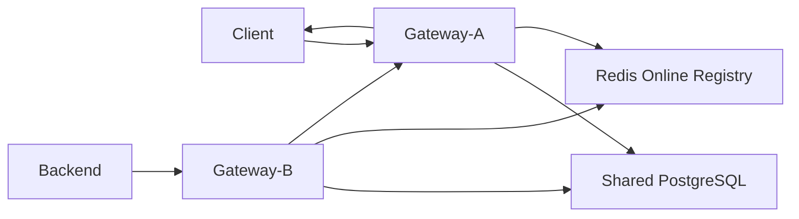
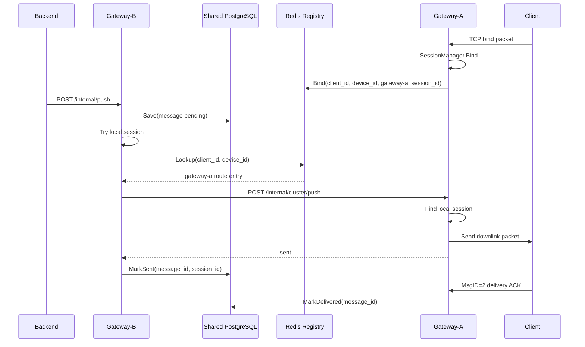
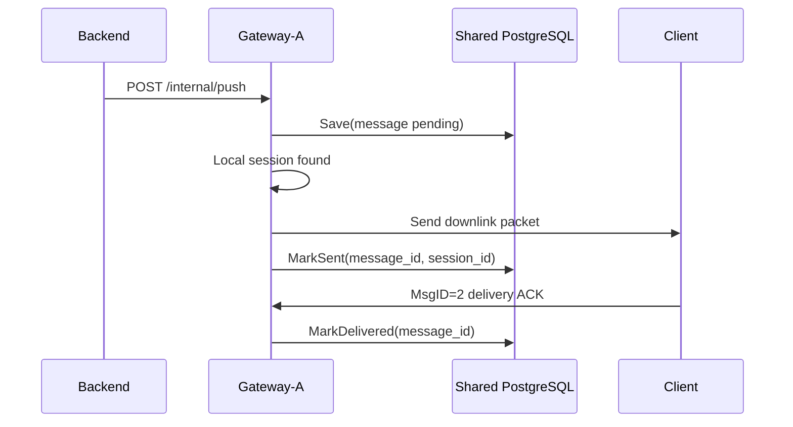
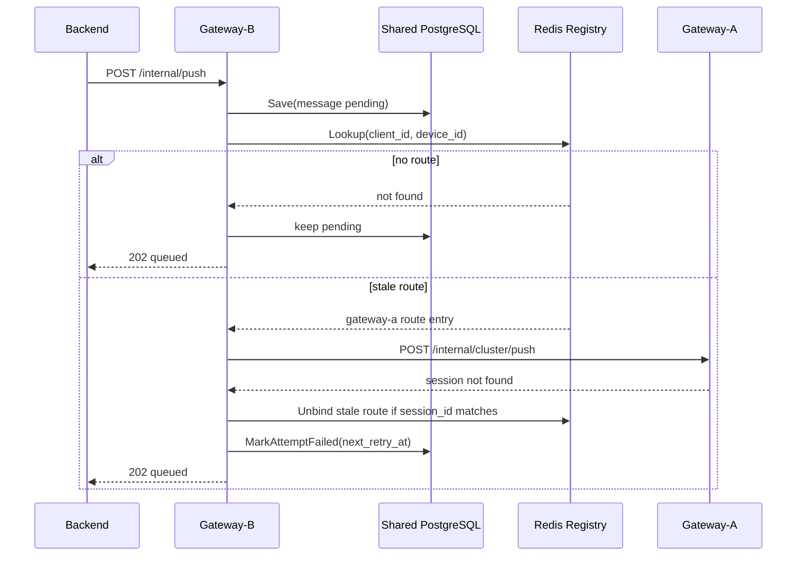

# V2 Cluster Architecture

V2 turns the V1 single-node reliable push gateway into a cluster-capable
gateway. The main problem is cross-node downlink delivery:

```text
Client is connected to Gateway-A.
Backend sends /internal/push to Gateway-B.
Gateway-B must find Gateway-A and dispatch the downlink packet there.
Gateway-A pushes to the local TCP connection.
Client ACK is accepted by Gateway-A and persisted in shared storage.
```

V2 keeps the V1 rule that Z-Courier does not understand business payloads. The
gateway still routes and delivers metadata envelopes with opaque body bytes.

## Goals

- Keep V1 single-node behavior working by default.
- Add a shared online route registry for `client_id + device_id`.
- Add gateway-to-gateway downlink dispatch.
- Keep reliable downlink storage compatible with PostgreSQL.
- Make stale online routes safe: a stale route should not lose the message.
- Provide local multi-node E2E coverage.

## Non-Goals

- V2 does not implement exactly-once delivery.
- V2 does not require a service mesh or microservice backend.
- V2 does not replace PostgreSQL as the reliable downlink store.
- V2 does not add full admin APIs or route hot reload yet.
- V2 does not implement SDKs yet.

## Target Topology



Key point:

```text
Session Manager = local in-memory connection table.
Online Registry = shared cluster route table.
Downlink Store = reliable message state storage.
```

## Components

### Local Session Manager

Existing V1 component:

```text
internal/session.Manager
```

It remains local to one gateway process. It knows:

```text
conn_id -> session
session_id -> conn_id
client_id + device_id -> conn_id
```

V2 should not replace it with Redis. TCP connections are process-local, so the
connection table must remain local.

### Online Registry

New V2 abstraction. It stores the cluster-visible route for a client device:

```go
type OnlineRegistry interface {
    Bind(ctx context.Context, entry RouteEntry) error
    Unbind(ctx context.Context, key RouteKey, sessionID string) error
    Lookup(ctx context.Context, key RouteKey) (RouteEntry, bool, error)
    Touch(ctx context.Context, entry RouteEntry) error
    Close() error
}
```

Suggested data types:

```go
type RouteKey struct {
    ClientID string
    DeviceID string
}

type RouteEntry struct {
    ClientID     string
    DeviceID     string
    SessionID    string
    GatewayNode  string
    InternalAddr string
    TokenID      string
    UpdatedAt    time.Time
    ExpiresAt    time.Time
}
```

The registry is an online hint, not the reliable source of message truth. If it
is missing or stale, the message stays pending in the downlink store and retry
will try again later.

### Redis Registry

First shared implementation:

```text
key: zcourier:online:{client_id}:{device_id}
ttl: cluster.registry.ttl
value:
  client_id
  device_id
  session_id
  gateway_node
  internal_addr
  token_id
  updated_at
```

Node metadata can be stored separately:

```text
key: zcourier:node:{gateway_node}
ttl: cluster.node.ttl
value:
  gateway_node
  internal_addr
  started_at
  updated_at
```

For V2, the device route entry may include `internal_addr` directly. A separate
node table is still useful for future health checks and admin views.

### Peer Dispatcher

New gateway-to-gateway client:

```go
type PeerDispatcher interface {
    Push(ctx context.Context, target RouteEntry, req PeerPushRequest) (*PeerPushResponse, error)
}
```

It calls the target gateway internal API:

```text
POST /internal/cluster/push
```

This API is for gateway peers only. The current implementation protects it with
`cluster.peer.token` in the `X-ZCourier-Internal-Token` header.

### Downlink Resolver

V1 `downlink.Service` currently tries local online delivery only. V2 should
split delivery into a resolver:

```text
1. Save message to shared store.
2. Try local session manager.
3. If not local, lookup online registry.
4. If target node is current node, retry local delivery.
5. If target node is remote, call PeerDispatcher.
6. If delivery fails, keep pending and schedule retry.
```

## Configuration

Suggested V2 config shape:

```yaml
gateway_node: gateway-a

cluster:
  enabled: true
  internal_addr: http://gateway-a:18082
  registry:
    type: redis
    ttl: 30s
    redis:
      addr: redis:6379
      username: ""
      password: ""
      db: 0
      key_prefix: zcourier
      dial_timeout: 1s
      read_timeout: 1s
      write_timeout: 1s
  peer:
    token: dev-cluster-token
    timeout: 2s
```

Compatibility rule:

```text
cluster.enabled = false
```

means V1 behavior: local session manager only, no Redis lookup, no peer
dispatch.

The existing `gateway_node` should remain the logical node identifier. V2 can
add `cluster.internal_addr` because other nodes need a callable address.

## Cross-Node Downlink Flow



Important property:

```text
The backend can call any gateway node.
The node that receives /internal/push owns the first Save.
The target node only pushes to its local TCP connection.
ACK can be handled by any node as long as storage is shared.
```

## Local Downlink Flow



This is the V1 flow with shared storage and the same local session manager.

## Offline Or Stale Route Flow



The stale-route case must be safe. A gateway should only remove a route when
the `session_id` still matches the stale entry it attempted to use.

## Peer Push API

Endpoint:

```text
POST /internal/cluster/push
```

Request body:

```json
{
  "origin_node": "gateway-b",
  "client_id": "client-1",
  "device_id": "device-1",
  "session_id": "zs_xxx",
  "msg_id": 2001,
  "message_id": "message-1",
  "trace_id": "trace-1",
  "ack_required": true,
  "body": "aGVsbG8="
}
```

Response body:

```json
{
  "code": "ok",
  "delivery_state": "sent",
  "gateway_node": "gateway-a",
  "session_id": "zs_xxx",
  "message_id": "message-1"
}
```

Recommended status behavior:

```text
200 sent              local TCP send succeeded
404 session_not_found route is stale or client disconnected
401 unauthorized      peer token invalid
429 rate_limited      peer protection rejected request
5xx retryable failure target gateway had an internal error
```

The peer endpoint should not create a new durable message row. Durable state is
owned by the node that received `/internal/push` and saved the message.

## ACK Handling

Client ACK still uses:

```text
MsgID = 2
```

The ACK packet is still sent from client to gateway. In cluster mode, the ACK
usually reaches the node that owns the TCP connection.

Because V2 reliable cluster mode uses shared downlink storage, that node can
call:

```text
Store.MarkDelivered(message_id, client_id, device_id, delivered_at)
```

without calling the origin node.

## Retry Worker

Every gateway node can run a retry worker. To avoid two nodes delivering the
same pending message at the same time, V2 should add claiming semantics to the
store before broad multi-node retry is enabled.

Suggested store extension:

```go
type ClusterStore interface {
    Store
    ClaimDuePending(ctx context.Context, now time.Time, limit int, owner string, lease time.Duration) ([]Message, error)
    ReleaseClaim(ctx context.Context, messageID string, owner string) error
}
```

V2 phase 1 can keep retry worker enabled only on one node in integration tests,
or rely on PostgreSQL row locking in the Postgres implementation.

## Metrics

New metrics to add in V2:

```text
z_courier_cluster_registry_lookup_total{result}
z_courier_cluster_registry_bind_total{result}
z_courier_cluster_peer_push_total{target_node,result}
z_courier_cluster_peer_push_duration_seconds{target_node,result}
z_courier_cluster_stale_routes_total
```

Existing V1 metrics should continue to work.

## Failure Rules

Registry unavailable:

```text
If the target is not locally online, keep the message pending and return queued.
Do not drop the message.
```

Peer gateway unavailable:

```text
Mark attempt failed, set next_retry_at, return queued.
```

Target session missing:

```text
Remove the registry entry only if session_id matches.
Keep message pending.
```

Duplicate delivery:

```text
Allowed under at-least-once semantics.
Client must de-duplicate by MessageID.
```

ACK arrives before MarkSent:

```text
Store.MarkDelivered should be idempotent where possible.
If the message exists and client/device match, delivered wins over sent.
```

## Implementation Plan

Current implementation status:

```text
Phase 1 is implemented: OnlineRegistry interface, in-memory registry, and
cluster config parsing.

Phase 2 bind/unbind hooks are implemented for cluster.enabled=true. The runtime
supports both memory and Redis online registries: session bind writes the
current route, and connection close removes the route only when session_id still
matches.

Peer Push API, the HTTP peer dispatcher, and cluster-aware downlink resolution
are implemented. `/internal/push` now tries local delivery first, then looks up
the online registry and calls the target gateway peer when the route points to a
remote node.

Multi-node E2E is implemented in scripts/e2e_cluster.sh. It starts gateway-a and
gateway-b with shared PostgreSQL and Redis, connects the test client to
gateway-b, sends /internal/push to gateway-a, and verifies cross-node delivery.

Store-level retry claiming is still a future phase.
```

### Phase 1: Interfaces And Config

- Add `internal/cluster` package.
- Add `OnlineRegistry` interface.
- Add in-memory registry implementation.
- Add cluster config parsing.
- Keep default `cluster.enabled = false`.

Acceptance:

```text
go test ./...
V1 e2e still passes
```

### Phase 2: Bind/Unbind Registry Hooks

- On session bind, write local route to registry.
- On connection stop, remove route if session id matches.
- Add registry touch or TTL refresh.

Acceptance:

```text
single gateway writes and removes route entries
stale unbind does not remove newer session entry
```

### Phase 3: Redis Registry

- Add Redis implementation.
- Add Redis config.
- Add tests with fake Redis or integration tests.

Acceptance:

```text
two gateway processes can see the same online route
route TTL expires after disconnect or missed refresh
```

### Phase 4: Peer Dispatch API

- Add `POST /internal/cluster/push`.
- Add peer HTTP client.
- Add internal peer auth token.
- Return `session_not_found` or `session_mismatch` so the caller can clean up a
  stale route if the registry entry still matches.

Acceptance:

```text
Gateway-B can ask Gateway-A to push to a local client
Gateway-A does not persist duplicate message rows
```

### Phase 5: Cluster Downlink Resolver

- Modify `downlink.Service` or wrap it with cluster-aware delivery.
- Try local delivery first.
- Lookup registry for remote delivery.
- Mark sent only after local or peer send succeeds.
- Keep pending on miss or retryable failure.

Acceptance:

```text
backend can call any node
remote client receives downlink message
client ACK marks shared message delivered
```

### Phase 6: Multi-Node E2E

- Extend local Docker Compose with Redis.
- Start two gateway processes on different TCP/internal ports.
- Connect client to Gateway-A.
- Send `/internal/push` to Gateway-B.
- Verify client receives message and ACK persists as delivered.

Acceptance:

```text
bash scripts/e2e_cluster.sh
GitHub Actions runs cluster e2e
```

## First Code Change Recommendation

Start with Phase 1:

```text
internal/cluster/
  registry.go
  memory_registry.go
  registry_test.go
```

Then add config structs without wiring them into delivery yet. That keeps V1
safe while giving V2 a clean extension point.
