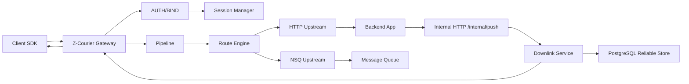

# 架构说明

Z-Courier 是一个可靠消息推送网关。它的核心职责是：

- 接入客户端 TCP 长连接。
- 通过 token 鉴权确认真实客户端身份。
- 维护 `client_id + device_id -> connection/session` 的在线关系。
- 按协议头里的 `MsgID` 路由客户端上行消息。
- 接收后端下行推送请求，并把消息送到目标客户端。
- 在客户端离线或 ACK 未返回时，通过 PostgreSQL 存储和重试保证至少一次投递。
- 暴露指标、诊断、管理 API 和 Web 控制台，方便部署和排障。

Z-Courier 不关心业务消息体。对网关来说，每个包都是：

```text
元数据 + opaque body
```

业务系统自己决定 body 的 JSON、Protobuf、加密、压缩、数据库事务和幂等逻辑。

## 不做什么

Z-Courier 明确不做这些事情：

- 不解析业务 body 字段。
- 不替代业务数据库。
- 不保证 exactly-once。它提供的是 at-least-once，业务侧仍要用 `MessageID`
  做持久化幂等。
- 不强制微服务架构。后端可以是单体应用，通过 HTTP 接口接入即可。
- 不内置 TLS、mTLS、Ingress、Service Mesh、账号体系，这些属于部署层职责。

## 总体流程



## 上行消息

上行指客户端发给后端的消息。

1. 客户端连接 TCP。
2. 客户端先发送 `MsgID = 1000` 的 `AUTH/BIND` 包。
3. 网关验证 token。
4. 验证成功后，网关绑定连接到真实 `client_id + device_id`。
5. 客户端发送业务包，例如 `MsgID = 2001`。
6. 网关经过通用 pipeline：协议校验、鉴权状态、黑白名单、限流、日志、指标。
7. Route Engine 根据 `MsgID` 找到 upstream route。
8. Forwarder 把消息转发给 HTTP 后端或 NSQ topic。
9. 如果客户端请求 ACK，网关返回 `MsgID = 1` 的 ACK 包。

上行路由只看元数据，不看 body 内容。这样 Z-Courier 可以作为通用中间件，而不是
绑定某个业务协议。

## 下行消息

下行指后端推给客户端的消息。

1. 后端调用内部 HTTP API：`POST /internal/push` 或 `/internal/push/batch`。
2. 网关验证内部请求。生产环境推荐 HMAC，开发环境可以用 token。
3. 网关按 `client_id + device_id` 查找本机 session。
4. 如果本机在线，直接写入客户端连接。
5. 如果不在本机并启用了 Redis cluster registry，查找目标 gateway 节点并 peer push。
6. 如果客户端离线并配置了 PostgreSQL store，消息进入可靠存储。
7. retry worker 按 `retry_interval`、`retry_delay`、`ack_timeout` 等配置继续投递。
8. 客户端收到需要 ACK 的消息后发送 `MsgID = 2` 的下行 ACK。

## 集群路由

单节点时，在线关系只存在内存里。集群时，网关会把在线关系写入 Redis：

```text
client_id + device_id -> gateway_node + internal_addr + session_id + ttl
```

当 `gateway-a` 收到推送请求，但客户端连在 `gateway-b` 上：

1. `gateway-a` 本机找不到 session。
2. `gateway-a` 查 Redis 在线路由。
3. 找到 `gateway-b` 的 internal HTTP 地址。
4. `gateway-a` 调用 `gateway-b` 的 peer push API。
5. `gateway-b` 找到本机连接并推送给客户端。

Redis 路由有 TTL，gateway 会周期刷新。连接断开或 gateway 关闭时，会尽量解绑路由。

## 可靠投递边界

Z-Courier 负责网关层的可靠性：

- 离线消息入 PostgreSQL。
- 在线发送后等待客户端 ACK。
- ACK 超时后进入重试。
- 重连后按 `client_id + device_id` 刷出 pending 消息。
- 运维可以查询、requeue、discard 下行消息。

业务侧仍然必须负责业务幂等：

- `MessageID` 应该全局唯一。
- 订单、支付、发券等关键业务要在业务数据库里对 `MessageID` 建唯一约束。
- 客户端重复收到消息时，业务处理要能去重。

## 可观测性

Z-Courier 暴露：

- `/metrics`：Prometheus 指标。
- `/healthz`：进程健康。
- `/readyz`：是否可接流量，drain 时会变成不可用。
- `cmd/admin`：命令行运维工具。
- Web admin console：浏览器管理控制台。
- Grafana dashboards：概览和生产信号。
- Alertmanager examples：告警通知示例。

常看指标包括：

- 在线连接数和在线 client 数。
- 上行转发成功率、失败率、延迟。
- 下行 push、ACK、retry、discard。
- Redis cluster route、peer push。
- auth/JWKS/HMAC 验证。
- upstream route degraded/unavailable。
- capacity limiter 和 rate limiter 拒绝。
